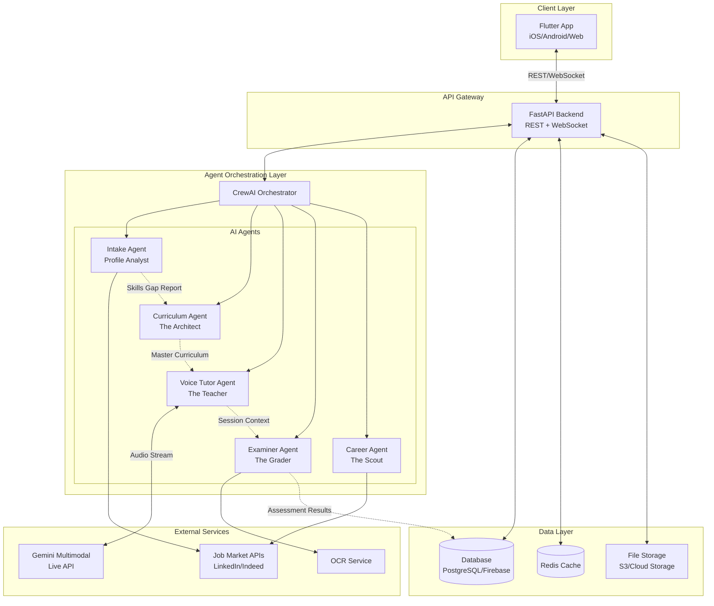

# Design Document: AI Voice-First Personalized Learning Platform

## Overview

The AI Voice-First Personalized Learning Platform is a sophisticated educational system that combines multi-agent AI architecture with real-time voice interaction to deliver personalized learning experiences. The platform orchestrates five specialized AI agents—Intake, Curriculum, Voice Tutor, Examiner, and Career—to provide end-to-end learning journeys from profile analysis through assessment and career guidance.

The system architecture follows a microservices pattern with a Flutter frontend for cross-platform delivery, a Python FastAPI backend for business logic, CrewAI for agent orchestration, and Gemini Multimodal Live API for native audio processing. The design emphasizes real-time bidirectional communication via WebSockets, enabling natural voice interactions with barge-in support that simulates authentic classroom experiences.

Key architectural principles include:
- **Agent Autonomy**: Each agent operates independently with well-defined responsibilities
- **Event-Driven Communication**: Agents communicate through standardized JSON messages
- **Stateful Sessions**: Learning sessions maintain context across pauses and resumptions
- **Adaptive Personalization**: Curriculum and difficulty adjust dynamically based on performance
- **Market-Driven Content**: Learning paths reflect current industry demands through continuous market data integration

## Architecture

### System Architecture Diagram



### Communication Flow

1. **Onboarding Flow**: User → FastAPI → Intake Agent → Curriculum Agent → Database
2. **Learning Session Flow**: User → FastAPI → Voice Tutor Agent ↔ Gemini API → Examiner Agent → Database
3. **Career Discovery Flow**: Database → Career Agent → Job APIs → FastAPI → User

### Technology Stack

- **Frontend**: Flutter 3.x (Dart) for cross-platform mobile and web
- **Backend**: Python 3.11+ with FastAPI framework
- **Agent Orchestration**: CrewAI for multi-agent coordination
- **Voice AI**: Google Gemini 2.0 Flash Multimodal Live API
- **Database**: PostgreSQL for relational data, Redis for caching and session state
- **File Storage**: AWS S3 or Google Cloud Storage for resumes and media
- **Real-time Communication**: WebSocket (Socket.IO or native WebSocket)
- **Authentication**: JWT tokens with OAuth 2.0 support
- **Deployment**: Docker containers on Kubernetes or cloud-native services

## Components and Interfaces

### 1. Authentication Service

**Responsibility**: Manage user authentication, authorization, and session management.

**Interface**:
```python
class AuthenticationService:
    def register_user(email: str, password: str, provider: Optional[str]) -> User:
        """Register new user with email/password or OAuth provider"""
        
    def authenticate(email: str, password: str) -> AuthToken:
        """Authenticate user and return JWT token"""
        
    def validate_token(token: str) -> User:
        """Validate JWT token and return user object"""
        
    def refresh_token(refresh_token: str) -> AuthToken:
        """Refresh expired access token"""
        
    def logout(user_id: str) -> bool:
        """Invalidate user session"""
```

**Key Features**:
- JWT-based stateless authentication
- OAuth 2.0 integration (Google, GitHub, LinkedIn)
- Token refresh mechanism with sliding expiration
- Secure password hashing using bcrypt

### 2. Intake Agent (Profile Analyst)

**Responsibility**: Extract skills from resumes, analyze job market trends, and identify skill gaps.

**Interface**:
```python
class IntakeAgent:
    def extract_skills(resume_file: File) -> List[Skill]:
        """Extract technical and professional skills from resume"""
        
    def query_market_trends(skills: List[Skill], target_role: Optional[str]) -> MarketData:
        """Query job market APIs for current skill demands"""
        
    def perform_gap_analysis(user_skills: List[Skill], market_data: MarketData) -> SkillsGapReport:
        """Compare user skills against market requirements"""
        
    def assess_feasibility(experience: Experience, target_domain: str) -> FeasibilityReport:
        """Assess career switch feasibility for Career Switch mode"""
```

**Data Structures**:
```python
@dataclass
class Skill:
    name: str
    category: str  # technical, soft, domain
    proficiency_level: int  # 1-5
    years_experience: float
    
@dataclass
class SkillsGapReport:
    user_id: str
    identified_gaps: List[SkillGap]
    priority_skills: List[Skill]
    market_relevance_scores: Dict[str, float]
    recommended_learning_path: str
    generated_at: datetime
    
@dataclass
class SkillGap:
    skill_name: str
    current_level: int
    required_level: int
    market_demand: float
    priority: str  # high, medium, low
```

**Implementation Details**:
- Use NLP libraries (spaCy, NLTK) for resume parsing
- Integrate with LinkedIn Talent Insights, Indeed API, Glassdoor API
- Implement caching for market data (24-hour TTL)
- Support multiple resume formats (PDF, DOCX) using PyPDF2 and python-docx

### 3. Curriculum Agent (The Architect)

**Responsibility**: Generate personalized day-by-day learning roadmaps based on skill gaps and time constraints.

**Interface**:
```python
class CurriculumAgent:
    def generate_curriculum(gap_report: SkillsGapReport, time_constraint: int, mode: LearningMode) -> MasterCurriculum:
        """Generate complete learning roadmap"""
        
    def adjust_difficulty(user_id: str, performance_history: List[SessionScore]) -> CurriculumUpdate:
        """Adjust curriculum difficulty based on performance"""
        
    def insert_review_session(user_id: str, struggling_topics: List[str]) -> CurriculumUpdate:
        """Insert review sessions for struggling topics"""
        
    def update_for_market_trends(curriculum_id: str, new_trends: List[Skill]) -> CurriculumUpdate:
        """Update curriculum to reflect new market trends"""
```

**Data Structures**:
```python
@dataclass
class MasterCurriculum:
    curriculum_id: str
    user_id: str
    learning_mode: LearningMode
    total_days: int
    daily_modules: List[DailyModule]
    created_at: datetime
    last_updated: datetime
    
@dataclass
class DailyModule:
    day_number: int
    topic: str
    concepts: List[Concept]
    real_world_examples: List[Example]
    quiz_questions: List[Question]
    estimated_duration_minutes: int  # should be <= 50
    prerequisites: List[str]
    learning_objectives: List[str]
    
@dataclass
class Concept:
    concept_id: str
    title: str
    description: str
    difficulty_level: int  # 1-5
    key_points: List[str]
    
@dataclass
class Question:
    question_id: str
    text: str
    question_type: str  # conceptual, practical, scenario
    difficulty: int
    correct_answer: str
    explanation: str
```

**Implementation Details**:
- Use LLM (GPT-4 or Claude) for curriculum generation with structured prompts
- Implement constraint solver to fit content within time limits
- Store curriculum templates for common learning paths
- Version control for curriculum updates

### 4. Voice Tutor Agent (The Teacher)

**Responsibility**: Conduct interactive voice-based teaching sessions following the master curriculum.

**Interface**:
```python
class VoiceTutorAgent:
    def start_session(user_id: str, day_number: int) -> SessionContext:
        """Initialize learning session with curriculum content"""
        
    def handle_audio_stream(audio_chunk: bytes, session_context: SessionContext) -> AudioResponse:
        """Process incoming audio and generate response"""
        
    def handle_interruption(session_context: SessionContext) -> InterruptionResponse:
        """Handle user barge-in during speech"""
        
    def answer_question(question: str, session_context: SessionContext) -> AudioResponse:
        """Answer user question while maintaining curriculum focus"""
        
    def transition_to_assessment(session_context: SessionContext) -> AssessmentContext:
        """Prepare session for examiner agent takeover"""
```

**Data Structures**:
```python
@dataclass
class SessionContext:
    session_id: str
    user_id: str
    day_number: int
    daily_module: DailyModule
    current_concept_index: int
    conversation_history: List[Message]
    start_time: datetime
    elapsed_minutes: int
    paused: bool
    
@dataclass
class AudioResponse:
    audio_data: bytes
    transcript: str
    emotion_tone: str  # encouraging, neutral, clarifying
    next_action: str  # continue, wait_for_response, transition
    
@dataclass
class Message:
    role: str  # user, tutor
    content: str
    timestamp: datetime
    audio_duration_seconds: float
```

**Implementation Details**:
- Establish WebSocket connection for bidirectional audio streaming
- Use Gemini Multimodal Live API for native audio processing
- Implement Voice Activity Detection (VAD) for barge-in support
- Maintain strict curriculum adherence through system prompts
- Buffer audio chunks for smooth playback
- Implement timeout handling for user responses

### 5. Examiner Agent (The Grader)

**Responsibility**: Assess learning through voice viva and code review, calculate session scores.

**Interface**:
```python
class ExaminerAgent:
    def conduct_viva(session_context: SessionContext) -> VivaAssessment:
        """Conduct 3-question voice viva"""
        
    def review_code(code: str, language: str, topic: str) -> CodeReview:
        """Analyze submitted code and provide feedback"""
        
    def process_code_photo(image: bytes) -> str:
        """Extract code from photo using OCR"""
        
    def calculate_session_score(viva_assessment: VivaAssessment, code_review: Optional[CodeReview]) -> SessionScore:
        """Calculate final session score (0-100)"""
        
    def update_leaderboard(user_id: str, score: SessionScore) -> LeaderboardUpdate:
        """Update user ranking on leaderboard"""
```

**Data Structures**:
```python
@dataclass
class VivaAssessment:
    session_id: str
    questions: List[VivaQuestion]
    answers: List[UserAnswer]
    scores: List[int]  # 0-100 per question
    overall_understanding: int  # 0-100
    
@dataclass
class VivaQuestion:
    question_text: str
    expected_key_points: List[str]
    difficulty: int
    
@dataclass
class UserAnswer:
    audio_transcript: str
    key_points_covered: List[str]
    accuracy_score: int
    
@dataclass
class CodeReview:
    code_snippet: str
    language: str
    syntax_score: int  # 0-100
    logic_score: int  # 0-100
    best_practices_score: int  # 0-100
    feedback: str
    suggestions: List[str]
    
@dataclass
class SessionScore:
    session_id: str
    user_id: str
    day_number: int
    viva_score: int
    code_score: Optional[int]
    final_score: int  # weighted average
    timestamp: datetime
```

**Implementation Details**:
- Use LLM for evaluating viva responses against expected key points
- Integrate static code analysis tools (pylint, ESLint) for code review
- Use Tesseract OCR or Google Cloud Vision API for code photo extraction
- Implement weighted scoring: viva (70%), code (30%)
- Real-time leaderboard updates using Redis sorted sets

### 6. Career Agent (The Scout)

**Responsibility**: Discover and recommend relevant career opportunities based on user skill level.

**Interface**:
```python
class CareerAgent:
    def search_opportunities(user_profile: UserProfile) -> List[Opportunity]:
        """Search for hackathons, internships, and jobs"""
        
    def filter_by_skill_level(opportunities: List[Opportunity], skill_level: int) -> List[Opportunity]:
        """Filter opportunities matching user's current level"""
        
    def calculate_relevance_score(opportunity: Opportunity, user_profile: UserProfile) -> float:
        """Calculate how relevant an opportunity is to the user"""
        
    def notify_new_opportunities(user_id: str, opportunities: List[Opportunity]) -> NotificationResult:
        """Send notifications for new matching opportunities"""
```

**Data Structures**:
```python
@dataclass
class Opportunity:
    opportunity_id: str
    type: str  # hackathon, internship, job
    title: str
    company: str
    description: str
    required_skills: List[Skill]
    experience_level: str  # entry, mid, senior
    location: str
    remote: bool
    url: str
    deadline: Optional[datetime]
    relevance_score: float
    
@dataclass
class UserProfile:
    user_id: str
    current_skills: List[Skill]
    learning_progress: int  # percentage
    completed_topics: List[str]
    average_score: float
    skill_level: int  # 1-5
```

**Implementation Details**:
- Integrate with LinkedIn Jobs API, Indeed API, GitHub Jobs
- Web scraping for hackathon platforms (Devpost, HackerEarth)
- Implement relevance scoring algorithm based on skill matching
- Schedule daily background jobs for opportunity discovery
- Use push notifications (Firebase Cloud Messaging) for alerts

### 7. Session Management Service

**Responsibility**: Manage learning session lifecycle, state persistence, and recovery.

**Interface**:
```python
class SessionManagementService:
    def create_session(user_id: str, day_number: int) -> Session:
        """Create new learning session"""
        
    def pause_session(session_id: str) -> SessionState:
        """Pause session and save state"""
        
    def resume_session(session_id: str) -> SessionContext:
        """Resume paused session with full context"""
        
    def auto_save_session(session_id: str, context: SessionContext) -> bool:
        """Auto-save session state every 2 minutes"""
        
    def conclude_session(session_id: str, score: SessionScore) -> SessionSummary:
        """Conclude session and generate summary"""
```

**Data Structures**:
```python
@dataclass
class Session:
    session_id: str
    user_id: str
    day_number: int
    status: str  # active, paused, completed, interrupted
    start_time: datetime
    end_time: Optional[datetime]
    duration_minutes: int
    
@dataclass
class SessionState:
    session_id: str
    current_concept_index: int
    conversation_history: List[Message]
    elapsed_time: int
    last_saved: datetime
```

**Implementation Details**:
- Store session state in Redis for fast access
- Implement auto-save timer (every 2 minutes)
- Handle WebSocket disconnections gracefully
- Persist completed sessions to PostgreSQL

### 8. Progress Tracking Service

**Responsibility**: Track user progress, maintain streaks, and manage leaderboard.

**Interface**:
```python
class ProgressTrackingService:
    def record_completion(user_id: str, session_score: SessionScore) -> ProgressUpdate:
        """Record session completion and update stats"""
        
    def calculate_streak(user_id: str) -> int:
        """Calculate current learning streak"""
        
    def get_user_statistics(user_id: str) -> UserStatistics:
        """Get comprehensive user statistics"""
        
    def update_leaderboard(user_id: str, score: int) -> LeaderboardPosition:
        """Update user position on leaderboard"""
        
    def get_leaderboard(limit: int) -> List[LeaderboardEntry]:
        """Get top users on leaderboard"""
```

**Data Structures**:
```python
@dataclass
class UserStatistics:
    user_id: str
    total_sessions: int
    completed_days: int
    average_score: float
    current_streak: int
    longest_streak: int
    total_learning_minutes: int
    leaderboard_rank: int
    
@dataclass
class LeaderboardEntry:
    rank: int
    user_id: str
    username: str
    total_score: int
    average_score: float
    streak: int
```

## Data Models

### User Model

```python
class User(BaseModel):
    user_id: str = Field(default_factory=lambda: str(uuid.uuid4()))
    email: str
    username: str
    password_hash: str
    oauth_provider: Optional[str]
    learning_mode: Optional[LearningMode]
    created_at: datetime = Field(default_factory=datetime.utcnow)
    last_login: Optional[datetime]
    profile_completed: bool = False
```

### Resume Model

```python
class Resume(BaseModel):
    resume_id: str = Field(default_factory=lambda: str(uuid.uuid4()))
    user_id: str
    file_path: str
    file_size_bytes: int
    file_format: str  # pdf, docx
    uploaded_at: datetime
    processed: bool = False
    extracted_skills: List[Skill] = []
```

### Curriculum Model

```python
class Curriculum(BaseModel):
    curriculum_id: str = Field(default_factory=lambda: str(uuid.uuid4()))
    user_id: str
    learning_mode: LearningMode
    total_days: int
    current_day: int = 1
    daily_modules: List[DailyModule]
    created_at: datetime
    last_updated: datetime
    version: int = 1
```

### Session Model

```python
class Session(BaseModel):
    session_id: str = Field(default_factory=lambda: str(uuid.uuid4()))
    user_id: str
    curriculum_id: str
    day_number: int
    status: SessionStatus
    start_time: datetime
    end_time: Optional[datetime]
    duration_minutes: int = 0
    viva_score: Optional[int]
    code_score: Optional[int]
    final_score: Optional[int]
    conversation_transcript: List[Message] = []
```

### Leaderboard Model

```python
class LeaderboardEntry(BaseModel):
    user_id: str
    username: str
    total_score: int
    average_score: float
    completed_sessions: int
    current_streak: int
    last_updated: datetime
```

### Database Schema

```sql
-- Users table
CREATE TABLE users (
    user_id UUID PRIMARY KEY,
    email VARCHAR(255) UNIQUE NOT NULL,
    username VARCHAR(100) NOT NULL,
    password_hash VARCHAR(255),
    oauth_provider VARCHAR(50),
    learning_mode VARCHAR(50),
    created_at TIMESTAMP DEFAULT CURRENT_TIMESTAMP,
    last_login TIMESTAMP,
    profile_completed BOOLEAN DEFAULT FALSE
);

-- Resumes table
CREATE TABLE resumes (
    resume_id UUID PRIMARY KEY,
    user_id UUID REFERENCES users(user_id) ON DELETE CASCADE,
    file_path VARCHAR(500) NOT NULL,
    file_size_bytes INTEGER,
    file_format VARCHAR(10),
    uploaded_at TIMESTAMP DEFAULT CURRENT_TIMESTAMP,
    processed BOOLEAN DEFAULT FALSE
);

-- Skills table
CREATE TABLE skills (
    skill_id UUID PRIMARY KEY,
    resume_id UUID REFERENCES resumes(resume_id) ON DELETE CASCADE,
    name VARCHAR(100) NOT NULL,
    category VARCHAR(50),
    proficiency_level INTEGER CHECK (proficiency_level BETWEEN 1 AND 5),
    years_experience DECIMAL(4,1)
);

-- Curricula table
CREATE TABLE curricula (
    curriculum_id UUID PRIMARY KEY,
    user_id UUID REFERENCES users(user_id) ON DELETE CASCADE,
    learning_mode VARCHAR(50) NOT NULL,
    total_days INTEGER NOT NULL,
    current_day INTEGER DEFAULT 1,
    curriculum_json JSONB NOT NULL,
    created_at TIMESTAMP DEFAULT CURRENT_TIMESTAMP,
    last_updated TIMESTAMP DEFAULT CURRENT_TIMESTAMP,
    version INTEGER DEFAULT 1
);

-- Sessions table
CREATE TABLE sessions (
    session_id UUID PRIMARY KEY,
    user_id UUID REFERENCES users(user_id) ON DELETE CASCADE,
    curriculum_id UUID REFERENCES curricula(curriculum_id),
    day_number INTEGER NOT NULL,
    status VARCHAR(20) NOT NULL,
    start_time TIMESTAMP NOT NULL,
    end_time TIMESTAMP,
    duration_minutes INTEGER DEFAULT 0,
    viva_score INTEGER CHECK (viva_score BETWEEN 0 AND 100),
    code_score INTEGER CHECK (code_score BETWEEN 0 AND 100),
    final_score INTEGER CHECK (final_score BETWEEN 0 AND 100),
    conversation_transcript JSONB
);

-- Progress table
CREATE TABLE progress (
    progress_id UUID PRIMARY KEY,
    user_id UUID REFERENCES users(user_id) ON DELETE CASCADE,
    total_sessions INTEGER DEFAULT 0,
    completed_days INTEGER DEFAULT 0,
    average_score DECIMAL(5,2),
    current_streak INTEGER DEFAULT 0,
    longest_streak INTEGER DEFAULT 0,
    total_learning_minutes INTEGER DEFAULT 0,
    last_session_date DATE,
    updated_at TIMESTAMP DEFAULT CURRENT_TIMESTAMP
);

-- Opportunities table
CREATE TABLE opportunities (
    opportunity_id UUID PRIMARY KEY,
    type VARCHAR(50) NOT NULL,
    title VARCHAR(255) NOT NULL,
    company VARCHAR(255),
    description TEXT,
    required_skills JSONB,
    experience_level VARCHAR(50),
    location VARCHAR(255),
    remote BOOLEAN DEFAULT FALSE,
    url VARCHAR(500),
    deadline TIMESTAMP,
    discovered_at TIMESTAMP DEFAULT CURRENT_TIMESTAMP
);

-- User opportunities (many-to-many)
CREATE TABLE user_opportunities (
    user_id UUID REFERENCES users(user_id) ON DELETE CASCADE,
    opportunity_id UUID REFERENCES opportunities(opportunity_id) ON DELETE CASCADE,
    relevance_score DECIMAL(3,2),
    notified BOOLEAN DEFAULT FALSE,
    PRIMARY KEY (user_id, opportunity_id)
);

-- Indexes for performance
CREATE INDEX idx_users_email ON users(email);
CREATE INDEX idx_sessions_user_id ON sessions(user_id);
CREATE INDEX idx_sessions_status ON sessions(status);
CREATE INDEX idx_curricula_user_id ON curricula(user_id);
CREATE INDEX idx_progress_user_id ON progress(user_id);
CREATE INDEX idx_opportunities_type ON opportunities(type);
```


## Correctness Properties

A property is a characteristic or behavior that should hold true across all valid executions of a system—essentially, a formal statement about what the system should do. Properties serve as the bridge between human-readable specifications and machine-verifiable correctness guarantees.

### Property 1: Learning Mode Input Validation

*For any* selected learning mode, the system should prompt for the correct mode-specific inputs (resume for Upskill, job description + experience for Career Switch, topic + time constraint for Learn New Skill).

**Validates: Requirements 1.3**

### Property 2: Resume File Validation

*For any* uploaded file, if the file format is not PDF or DOCX, or if the file size exceeds 5MB, the system should reject the upload and maintain the current state.

**Validates: Requirements 1.4**

### Property 3: Authentication Persistence

*For any* authenticated user session, subsequent requests within the token validity period should maintain the authenticated state without requiring re-authentication.

**Validates: Requirements 1.5**

### Property 4: Skills Extraction Completeness

*For any* valid resume document, the Intake Agent should extract all identifiable technical and professional skills present in the document.

**Validates: Requirements 2.1**

### Property 5: Market Data Query Execution

*For any* set of extracted skills, the Intake Agent should query job market APIs with parameters matching those skills.

**Validates: Requirements 2.2**

### Property 6: Gap Analysis Output Validity

*For any* combination of user skills and market data, the gap analysis should produce a Skills Gap Report containing all required fields (identified gaps, priority levels, market relevance scores).

**Validates: Requirements 2.3, 2.4**

### Property 7: Career Switch Feasibility Trigger

*For any* user who selects Career Switch mode, the Intake Agent should perform feasibility analysis before generating the curriculum.

**Validates: Requirements 2.5**

### Property 8: Curriculum Generation Completeness

*For any* valid Skills Gap Report, the Curriculum Agent should generate a Master Curriculum with at least one daily module for each identified skill gap.

**Validates: Requirements 3.1**

### Property 9: Daily Module Time Constraint

*For any* generated daily module, the estimated duration should not exceed 50 minutes.

**Validates: Requirements 3.2**

### Property 10: Daily Module Structure Compliance

*For any* daily module in the Master Curriculum, the structure should follow the pattern: Concept Introduction → Real-World Example → Quiz Questions, with at least one element of each type present.

**Validates: Requirements 3.3**

### Property 11: Timeline Constraint Satisfaction

*For any* user-specified time constraint T days, the generated Master Curriculum should contain at most T daily modules.

**Validates: Requirements 3.4**

### Property 12: Curriculum JSON Format Validity

*For any* generated Master Curriculum, the output should be valid JSON that can be parsed without errors and contains all required fields (curriculum_id, user_id, daily_modules).

**Validates: Requirements 3.5**

### Property 13: Curriculum Update Propagation

*For any* Master Curriculum, when market trend data changes, the Curriculum Agent should generate an updated version with incremented version number.

**Validates: Requirements 3.6**

### Property 14: WebSocket Connection Establishment

*For any* learning session start request, the Voice Tutor Agent should establish a WebSocket connection before beginning content delivery.

**Validates: Requirements 4.1**

### Property 15: Curriculum Adherence

*For any* teaching content delivered by the Voice Tutor Agent, the topics and concepts should match those specified in the corresponding daily module of the Master Curriculum.

**Validates: Requirements 4.2**

### Property 16: Session Wrap-up Transition

*For any* learning session, when the elapsed time reaches 40 minutes, the Voice Tutor Agent should transition to wrap-up mode and prepare for assessment handoff.

**Validates: Requirements 4.6**

### Property 17: Examiner Activation Timing

*For any* learning session, the Examiner Agent should activate when the session reaches the final 10 minutes (40-50 minute mark).

**Validates: Requirements 5.1**

### Property 18: Viva Question Count

*For any* viva assessment, the Examiner Agent should ask exactly 3 conceptual questions.

**Validates: Requirements 5.2**

### Property 19: Code Review Feedback Generation

*For any* submitted code snippet or photo, the Examiner Agent should produce feedback containing analysis of syntax, logic, and best practices.

**Validates: Requirements 5.3**

### Property 20: Session Score Bounds

*For any* completed assessment, the calculated session score should be an integer between 0 and 100 (inclusive).

**Validates: Requirements 5.4**

### Property 21: Leaderboard Update Immediacy

*For any* calculated session score, the user's profile and leaderboard ranking should be updated before the session conclusion response is sent to the user.

**Validates: Requirements 5.5**

### Property 22: Session Completion Recording

*For any* completed learning session, the system should record a completion entry containing session_id, user_id, day_number, score, and timestamp.

**Validates: Requirements 6.1**

### Property 23: Progress Statistics Completeness

*For any* user dashboard request, the displayed statistics should include session count, average score, and learning streak.

**Validates: Requirements 6.3**

### Property 24: Leaderboard Ranking Correctness

*For any* two users A and B on the leaderboard, if A's total score is greater than B's total score, then A's rank should be lower (better) than B's rank.

**Validates: Requirements 6.4**

### Property 25: Streak Increment on Consecutive Sessions

*For any* user who completes sessions on consecutive days, the streak counter should increment by 1 for each consecutive day.

**Validates: Requirements 6.5**

### Property 26: Opportunity Search Trigger

*For any* user profile update that changes the skill set, the Career Agent should initiate a new opportunity search.

**Validates: Requirements 7.1**

### Property 27: Opportunity Filtering by Skill Level

*For any* set of discovered opportunities, all opportunities presented to a user should have an experience level requirement that matches or is below the user's current skill level.

**Validates: Requirements 7.2**

### Property 28: Opportunity Relevance Score Presence

*For any* opportunity presented to a user, the opportunity object should include a relevance_score field with a value between 0 and 1.

**Validates: Requirements 7.3**

### Property 29: New Opportunity Notification

*For any* newly discovered opportunity that matches a user's criteria, the system should send a notification to that user.

**Validates: Requirements 7.5**

### Property 30: Code Input Method Acceptance

*For any* code review request, the system should accept input via either text snippet or photo upload.

**Validates: Requirements 8.1**

### Property 31: OCR Text Extraction

*For any* uploaded code photo, the system should produce a text string containing the extracted code.

**Validates: Requirements 8.2**

### Property 32: Code Analysis Completeness

*For any* submitted code, the Examiner Agent's analysis should cover syntax correctness, logic correctness, and best practices adherence.

**Validates: Requirements 8.3**

### Property 33: Code Review Voice Feedback

*For any* completed code analysis, the Examiner Agent should generate voice feedback that can be played to the user.

**Validates: Requirements 8.4**

### Property 34: Multi-Language Code Support

*For any* programming language specified in the current curriculum topic, the system should accept and analyze code written in that language.

**Validates: Requirements 8.5**

### Property 35: Agent Workflow Automation

*For any* agent that completes its task successfully, the system should automatically trigger the next agent in the workflow sequence without manual intervention.

**Validates: Requirements 9.2**

### Property 36: Inter-Agent Message Schema Compliance

*For any* data shared between agents, the message format should conform to the predefined JSON schema for that message type.

**Validates: Requirements 9.3**

### Property 37: Graceful Error Degradation

*For any* agent that encounters an error, the system should log the error and continue operation without crashing the entire user experience.

**Validates: Requirements 9.4**

### Property 38: Agent State Persistence

*For any* agent state during an active session, if the session is paused and resumed, the agent state should be restored to its previous values.

**Validates: Requirements 9.5**

### Property 39: Cross-Device Progress Synchronization

*For any* user who switches from device A to device B, the learning progress visible on device B should match the progress from device A.

**Validates: Requirements 10.3**

### Property 40: Offline Content Accessibility

*For any* curriculum content that has been downloaded, the user should be able to access that content when the device is offline.

**Validates: Requirements 10.5**

### Property 41: Data-at-Rest Encryption

*For any* user data stored in the database, the data should be encrypted using AES-256 encryption.

**Validates: Requirements 11.1**

### Property 42: Data-in-Transit Encryption

*For any* data transmitted between client and server, the connection should use TLS 1.3 or higher.

**Validates: Requirements 11.2**

### Property 43: Resume PII Anonymization

*For any* stored resume, personally identifiable information (email, phone, address) should be anonymized or removed before agent processing.

**Validates: Requirements 11.3**

### Property 44: Data Deletion Timeline

*For any* user data deletion request, all associated data should be permanently removed within 30 days of the request.

**Validates: Requirements 11.5**

### Property 45: Session Pause State Preservation

*For any* paused learning session, the system should save the current concept index, conversation history, and elapsed time.

**Validates: Requirements 12.1**

### Property 46: Session Resume Continuity

*For any* resumed learning session, the Voice Tutor Agent should continue from the saved concept index with access to the previous conversation history.

**Validates: Requirements 12.2**

### Property 47: Auto-Save Frequency

*For any* active learning session, the system should automatically save the session state at intervals of 2 minutes or less.

**Validates: Requirements 12.3**

### Property 48: Low Score Restart Eligibility

*For any* completed session with a final score below 60%, the system should allow the user to restart that day's session.

**Validates: Requirements 12.4**

### Property 49: Session Time Limit Enforcement

*For any* learning session that reaches 50 minutes of elapsed time, the system should automatically conclude the session and save progress.

**Validates: Requirements 12.5**

### Property 50: High Performance Difficulty Increase

*For any* user who scores above 90% for three consecutive sessions, the Curriculum Agent should increase the difficulty level for subsequent daily modules.

**Validates: Requirements 13.1**

### Property 51: Low Performance Review Insertion

*For any* user who scores below 60% for two consecutive sessions, the Curriculum Agent should insert review sessions before advancing to new topics.

**Validates: Requirements 13.2**

### Property 52: Difficulty Adjustment Timeline Preservation

*For any* curriculum difficulty adjustment, the total number of days should not exceed the user's original time constraint.

**Validates: Requirements 13.3**

### Property 53: Content Volume Adaptation

*For any* user with measured comprehension velocity V, the daily content volume should adjust proportionally to V (faster learners get more content, slower learners get less).

**Validates: Requirements 13.4**

### Property 54: Struggle-Based Additional Content

*For any* concept where a user asks multiple clarifying questions or provides incorrect answers, the Voice Tutor Agent should provide additional examples beyond the curriculum baseline.

**Validates: Requirements 13.5**

### Property 55: Market Data Query Frequency

*For any* 7-day period, the Intake Agent should query job market APIs at least once.

**Validates: Requirements 14.1**

### Property 56: Trending Technology Module Suggestion

*For any* newly trending technology that appears in market data and relates to the user's domain, the Curriculum Agent should suggest an optional module for that technology.

**Validates: Requirements 14.2**

### Property 57: Declining Relevance Notification

*For any* skill in the user's curriculum that shows declining market relevance (>20% decrease in demand), the system should notify the user.

**Validates: Requirements 14.3**

### Property 58: Multi-Provider Market Data Sourcing

*For any* market data query, the system should attempt to retrieve data from at least two different provider APIs.

**Validates: Requirements 14.4**

### Property 59: Market Data Fallback to Cache

*For any* market data query that fails due to API unavailability, the system should use cached data from the most recent successful query.

**Validates: Requirements 14.5**

### Property 60: Multi-Language Voice Recognition

*For any* supported language L, when a user speaks in language L, the Voice Tutor Agent should correctly recognize and process the speech.

**Validates: Requirements 15.1**

### Property 61: Speech Rate Adjustment Range

*For any* speech rate adjustment request, the system should support rates between 0.5x and 2.0x of normal speed.

**Validates: Requirements 15.2**

### Property 62: Text-to-Speech and Speech-to-Text Availability

*For any* user session, both text-to-speech and speech-to-text features should be available and functional.

**Validates: Requirements 15.4**

### Property 63: Real-Time Caption Generation

*For any* voice interaction when accessibility mode is enabled, the system should generate and display captions with a delay of no more than 2 seconds from speech.

**Validates: Requirements 15.5**

## Error Handling

### Error Categories and Strategies

#### 1. Authentication Errors

**Scenarios**:
- Invalid credentials
- Expired tokens
- OAuth provider failures

**Handling Strategy**:
- Return clear error messages without exposing security details
- Implement exponential backoff for repeated failed attempts
- Provide token refresh mechanism before expiration
- Fallback to email/password if OAuth fails

**Example**:
```python
try:
    user = authenticate(email, password)
except InvalidCredentialsError:
    return {"error": "Invalid email or password", "code": "AUTH_001"}
except AccountLockedError:
    return {"error": "Account temporarily locked. Try again in 15 minutes", "code": "AUTH_002"}
```

#### 2. Resume Processing Errors

**Scenarios**:
- Corrupted file uploads
- Unsupported file formats
- Skill extraction failures
- OCR errors for code photos

**Handling Strategy**:
- Validate file format and size before processing
- Implement retry logic with exponential backoff
- Provide partial results if extraction partially succeeds
- Log failures for manual review

**Example**:
```python
try:
    skills = intake_agent.extract_skills(resume_file)
except UnsupportedFormatError:
    return {"error": "Please upload PDF or DOCX format", "code": "RESUME_001"}
except CorruptedFileError:
    return {"error": "File appears corrupted. Please re-upload", "code": "RESUME_002"}
except ExtractionError as e:
    logger.error(f"Partial extraction failure: {e}")
    return {"skills": e.partial_results, "warning": "Some skills may not have been detected"}
```

#### 3. Agent Communication Errors

**Scenarios**:
- Agent timeout
- Invalid message format
- Agent unavailability
- Workflow interruption

**Handling Strategy**:
- Implement circuit breaker pattern for agent calls
- Queue messages for retry if agent is temporarily unavailable
- Validate message schemas before sending
- Maintain workflow state for recovery

**Example**:
```python
@circuit_breaker(failure_threshold=3, timeout=30)
async def call_curriculum_agent(gap_report):
    try:
        curriculum = await curriculum_agent.generate_curriculum(gap_report)
        return curriculum
    except AgentTimeoutError:
        logger.error("Curriculum agent timeout")
        raise
    except InvalidMessageError as e:
        logger.error(f"Invalid message format: {e}")
        # Retry with corrected format
        corrected_report = validate_and_correct(gap_report)
        return await curriculum_agent.generate_curriculum(corrected_report)
```

#### 4. WebSocket Connection Errors

**Scenarios**:
- Connection drops during session
- Network instability
- Audio stream interruption
- Gemini API failures

**Handling Strategy**:
- Implement automatic reconnection with exponential backoff
- Buffer audio chunks to handle temporary interruptions
- Save session state before each audio exchange
- Provide visual feedback for connection status

**Example**:
```python
class WebSocketHandler:
    async def handle_disconnect(self, session_id):
        # Save current state
        await session_service.auto_save_session(session_id)
        
        # Attempt reconnection
        for attempt in range(1, 6):
            await asyncio.sleep(2 ** attempt)  # Exponential backoff
            try:
                await self.reconnect(session_id)
                logger.info(f"Reconnected after {attempt} attempts")
                return
            except ConnectionError:
                continue
        
        # If all retries fail, notify user
        await self.notify_user(session_id, "Connection lost. Please restart session.")
```

#### 5. External API Errors

**Scenarios**:
- Job market API rate limits
- Gemini API quota exceeded
- OCR service unavailable
- OAuth provider downtime

**Handling Strategy**:
- Implement rate limiting and request queuing
- Use cached data as fallback
- Provide degraded functionality rather than complete failure
- Monitor API health and switch providers if needed

**Example**:
```python
async def query_market_data(skills):
    try:
        return await linkedin_api.get_skill_demand(skills)
    except RateLimitError:
        logger.warning("LinkedIn rate limit hit, trying Indeed")
        try:
            return await indeed_api.get_skill_demand(skills)
        except APIError:
            logger.error("All market APIs failed, using cache")
            return cache.get_market_data(skills, max_age_hours=24)
```

#### 6. Assessment Errors

**Scenarios**:
- Viva question generation failure
- Code analysis timeout
- Score calculation errors
- Leaderboard update conflicts

**Handling Strategy**:
- Have fallback question banks for viva
- Set timeouts for code analysis (max 30 seconds)
- Use default scoring if calculation fails
- Implement optimistic locking for leaderboard updates

**Example**:
```python
async def conduct_viva(session_context):
    try:
        questions = await examiner_agent.generate_viva_questions(session_context)
    except GenerationError:
        logger.warning("Using fallback question bank")
        questions = get_fallback_questions(session_context.topic)
    
    try:
        assessment = await examiner_agent.conduct_viva(questions)
        score = calculate_score(assessment)
    except ScoringError:
        logger.error("Score calculation failed, using partial credit")
        score = calculate_partial_score(assessment)
    
    return score
```

#### 7. Data Consistency Errors

**Scenarios**:
- Concurrent session updates
- Curriculum version conflicts
- Leaderboard race conditions
- Progress tracking inconsistencies

**Handling Strategy**:
- Use database transactions for critical updates
- Implement optimistic locking with version numbers
- Use Redis for atomic leaderboard operations
- Reconcile inconsistencies with background jobs

**Example**:
```python
async def update_progress(user_id, session_score):
    async with db.transaction():
        try:
            progress = await db.get_progress(user_id, lock=True)
            progress.total_sessions += 1
            progress.average_score = calculate_average(progress, session_score)
            progress.version += 1
            await db.save_progress(progress)
        except VersionConflictError:
            logger.warning("Progress update conflict, retrying")
            await asyncio.sleep(0.1)
            return await update_progress(user_id, session_score)
```

### Error Response Format

All API errors should follow a consistent format:

```json
{
  "error": {
    "code": "ERROR_CODE",
    "message": "Human-readable error message",
    "details": {
      "field": "Additional context",
      "suggestion": "What the user can do"
    },
    "timestamp": "2024-01-15T10:30:00Z",
    "request_id": "req_abc123"
  }
}
```

### Logging and Monitoring

- Log all errors with context (user_id, session_id, agent, timestamp)
- Implement structured logging (JSON format)
- Set up alerts for critical errors (authentication failures, agent crashes)
- Track error rates and patterns for proactive fixes
- Use distributed tracing for multi-agent workflows

## Testing Strategy

### Dual Testing Approach

The platform requires both unit testing and property-based testing to ensure comprehensive coverage:

- **Unit Tests**: Verify specific examples, edge cases, and error conditions
- **Property Tests**: Verify universal properties across all inputs through randomization

Both testing approaches are complementary and necessary. Unit tests catch concrete bugs in specific scenarios, while property tests verify general correctness across a wide range of inputs.

### Unit Testing Strategy

Unit tests should focus on:

1. **Specific Examples**: Demonstrate correct behavior for known inputs
   - Example: Test that a specific resume extracts expected skills
   - Example: Test that a known user profile generates expected curriculum structure

2. **Edge Cases**: Validate boundary conditions
   - Empty resume files
   - Maximum file size (5MB)
   - Sessions at exactly 50 minutes
   - Scores at boundaries (0, 60, 90, 100)

3. **Error Conditions**: Ensure proper error handling
   - Invalid file formats
   - Network timeouts
   - API failures
   - Invalid user inputs

4. **Integration Points**: Test component interactions
   - Agent handoffs (Intake → Curriculum → Voice Tutor → Examiner)
   - Database transactions
   - WebSocket connection lifecycle

**Unit Test Example**:
```python
def test_resume_validation_rejects_oversized_file():
    # Arrange
    large_file = create_mock_file(size_mb=6)
    
    # Act
    result = authentication_service.validate_resume(large_file)
    
    # Assert
    assert result.is_valid == False
    assert result.error_code == "RESUME_SIZE_EXCEEDED"
    assert result.max_size_mb == 5
```

### Property-Based Testing Strategy

Property tests should verify universal correctness properties using randomized inputs. The platform will use **Hypothesis** (Python) for property-based testing.

**Configuration**:
- Minimum 100 iterations per property test (due to randomization)
- Each test must reference its design document property
- Tag format: `# Feature: ai-voice-learning-platform, Property {N}: {property_text}`

**Property Test Categories**:

1. **Invariant Properties**: Conditions that always hold
   - Session scores always between 0-100
   - Daily modules always ≤ 50 minutes
   - Curriculum days ≤ user time constraint

2. **Round-Trip Properties**: Operations that reverse each other
   - Session pause → resume preserves state
   - JSON serialization → deserialization preserves curriculum

3. **Metamorphic Properties**: Relationships between operations
   - Higher scores → better leaderboard rank
   - More completed sessions → higher total score

4. **Error Condition Properties**: Invalid inputs handled correctly
   - Invalid file formats rejected
   - Out-of-range scores rejected
   - Malformed JSON rejected

**Property Test Example**:
```python
from hypothesis import given, strategies as st

# Feature: ai-voice-learning-platform, Property 20: Session Score Bounds
@given(
    viva_score=st.integers(min_value=0, max_value=100),
    code_score=st.integers(min_value=0, max_value=100)
)
def test_session_score_always_in_valid_range(viva_score, code_score):
    # Arrange
    assessment = create_assessment(viva_score=viva_score, code_score=code_score)
    
    # Act
    final_score = examiner_agent.calculate_session_score(assessment)
    
    # Assert
    assert 0 <= final_score <= 100, f"Score {final_score} outside valid range"
```

**Property Test Example 2**:
```python
# Feature: ai-voice-learning-platform, Property 11: Timeline Constraint Satisfaction
@given(
    time_constraint_days=st.integers(min_value=7, max_value=365),
    skill_gaps=st.lists(st.text(min_size=1), min_size=1, max_size=20)
)
def test_curriculum_fits_within_timeline(time_constraint_days, skill_gaps):
    # Arrange
    gap_report = create_gap_report(skill_gaps=skill_gaps)
    
    # Act
    curriculum = curriculum_agent.generate_curriculum(
        gap_report=gap_report,
        time_constraint=time_constraint_days,
        mode=LearningMode.UPSKILL
    )
    
    # Assert
    assert len(curriculum.daily_modules) <= time_constraint_days, \
        f"Curriculum has {len(curriculum.daily_modules)} days but constraint is {time_constraint_days}"
```

### Integration Testing

Integration tests verify end-to-end workflows:

1. **Complete Onboarding Flow**: Registration → Resume Upload → Gap Analysis → Curriculum Generation
2. **Learning Session Flow**: Session Start → Voice Interaction → Assessment → Score Recording
3. **Career Discovery Flow**: Profile Update → Opportunity Search → Notification Delivery
4. **Cross-Device Sync**: Action on Device A → Verify on Device B

### Performance Testing

Performance benchmarks:

- Resume processing: < 10 seconds for 5MB file
- Curriculum generation: < 30 seconds for 90-day plan
- WebSocket latency: < 200ms round-trip
- Voice response time: < 1 second from user speech end
- Leaderboard update: < 500ms
- API response time (95th percentile): < 2 seconds

### Security Testing

Security test scenarios:

- SQL injection attempts in user inputs
- XSS attempts in conversation transcripts
- JWT token tampering
- Unauthorized access to other users' data
- Rate limiting enforcement
- Data encryption verification

### Test Coverage Goals

- Unit test coverage: > 80% of code
- Property test coverage: 100% of correctness properties
- Integration test coverage: All critical user workflows
- API endpoint coverage: 100% of public endpoints

### Continuous Testing

- Run unit tests on every commit
- Run property tests on every pull request
- Run integration tests nightly
- Run performance tests weekly
- Run security scans on every release

