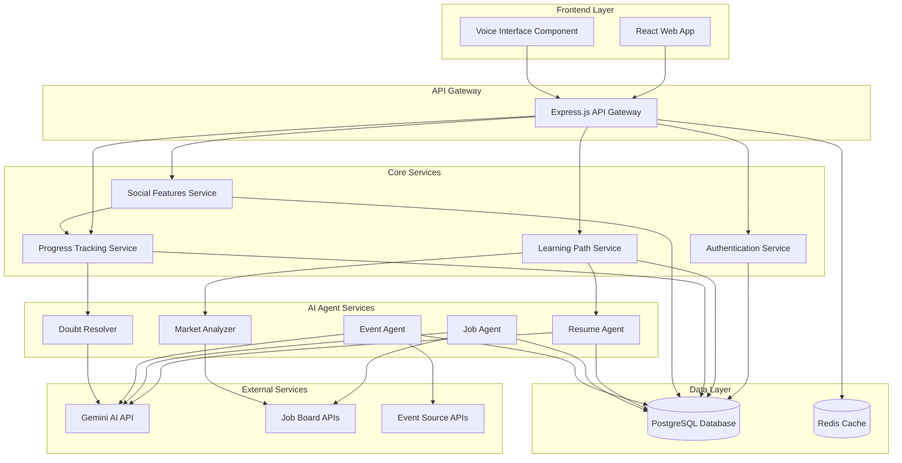

# Design Document: AI-Powered Voice-First Learning Application

## Overview

The AI-powered voice-first learning application is built as a microservices architecture with React frontend, Node.js backend services, PostgreSQL database, and Gemini AI integration. The system emphasizes voice-first interactions while providing comprehensive learning path management, social features, and career development tools.

The architecture follows a modular design with specialized AI agents (Resume, Job, Event) that work together to provide personalized learning experiences. The voice interface serves as the primary interaction method, supported by real-time doubt resolution and progress tracking.

## Architecture

### High-Level Architecture



### Service Communication

Services communicate through RESTful APIs with JWT-based authentication. Real-time features (doubt resolution, progress updates) use WebSocket connections. AI services integrate with Gemini API using the gemini-2.5-flash-native-audio-latest model for voice processing.

## Components and Interfaces

### Frontend Components

**VoiceInterface Component**
- Handles speech-to-text and text-to-speech conversion
- Manages conversation context and session state
- Provides fallback text input when voice fails
- Integrates with Web Speech API and Gemini native audio

**LearningDashboard Component**
- Displays personalized learning paths and progress
- Shows daily milestones and completion status
- Provides access to doubt resolution during sessions
- Renders progress visualizations and achievement badges

**SocialHub Component**
- Manages friend connections and social interactions
- Displays leaderboards and achievement sharing
- Handles privacy settings and notification preferences
- Shows shared learning resources and group challenges

### Backend Services

**Authentication Service**
```typescript
interface AuthService {
  registerUser(userData: UserRegistration): Promise<User>
  authenticateUser(credentials: LoginCredentials): Promise<AuthToken>
  validateToken(token: string): Promise<User>
  refreshToken(refreshToken: string): Promise<AuthToken>
}
```

**Learning Path Service**
```typescript
interface LearningPathService {
  generatePath(userProfile: UserProfile, goals: LearningGoals): Promise<LearningPath>
  updateProgress(userId: string, milestoneId: string): Promise<ProgressUpdate>
  adjustPath(pathId: string, marketTrends: MarketData): Promise<LearningPath>
  getNextMilestone(pathId: string): Promise<Milestone>
}
```

**Progress Tracking Service**
```typescript
interface ProgressTrackingService {
  recordActivity(userId: string, activity: LearningActivity): Promise<void>
  calculateStreak(userId: string): Promise<StreakData>
  getProgressSummary(userId: string, timeframe: TimeFrame): Promise<ProgressSummary>
  generateAchievements(userId: string): Promise<Achievement[]>
}
```

### AI Agent Interfaces

**Resume Agent**
```typescript
interface ResumeAgent {
  parseResume(resumeFile: File): Promise<ParsedResumeData>
  analyzeResume(resumeData: ParsedResumeData, targetRole?: string): Promise<ResumeAnalysis>
  suggestImprovements(analysis: ResumeAnalysis): Promise<ImprovementSuggestion[]>
  trackImprovementScore(userId: string): Promise<ScoreHistory>
}
```

**Job Agent**
```typescript
interface JobAgent {
  searchJobs(userProfile: UserProfile, preferences: JobPreferences): Promise<JobMatch[]>
  analyzeSkillGap(job: JobPosting, userSkills: Skill[]): Promise<SkillGapAnalysis>
  trackApplications(userId: string): Promise<ApplicationStatus[]>
  getMarketInsights(skills: Skill[]): Promise<MarketInsights>
}
```

**Doubt Resolver**
```typescript
interface DoubtResolver {
  processQuestion(question: string, context: LearningContext): Promise<Answer>
  clarifyQuestion(question: string): Promise<ClarificationRequest>
  provideAlternativeExplanation(questionId: string): Promise<AlternativeAnswer>
  trackQuestionEffectiveness(questionId: string, helpful: boolean): Promise<void>
}
```

## Data Models

### User and Profile Models

```typescript
interface User {
  id: string
  email: string
  username: string
  createdAt: Date
  lastActiveAt: Date
  preferences: UserPreferences
}

interface UserProfile {
  userId: string
  skills: Skill[]
  experience: WorkExperience[]
  education: Education[]
  careerGoals: CareerGoal[]
  resumeData: ParsedResumeData
  updatedAt: Date
}

interface Skill {
  name: string
  level: SkillLevel // BEGINNER, INTERMEDIATE, ADVANCED, EXPERT
  yearsOfExperience: number
  certifications: string[]
  lastAssessed: Date
}
```

### Learning Models

```typescript
interface LearningPath {
  id: string
  userId: string
  title: string
  description: string
  estimatedDuration: number // in days
  milestones: Milestone[]
  marketTrends: MarketTrendData[]
  createdAt: Date
  lastUpdated: Date
}

interface Milestone {
  id: string
  pathId: string
  title: string
  description: string
  estimatedHours: number
  prerequisites: string[]
  learningResources: LearningResource[]
  assessments: Assessment[]
  completed: boolean
  completedAt?: Date
}

interface LearningActivity {
  id: string
  userId: string
  milestoneId: string
  activityType: ActivityType // READING, VIDEO, PRACTICE, ASSESSMENT
  duration: number // in minutes
  completionRate: number // 0-100
  timestamp: Date
}
```

### Social and Gamification Models

```typescript
interface Friendship {
  id: string
  requesterId: string
  recipientId: string
  status: FriendshipStatus // PENDING, ACCEPTED, BLOCKED
  createdAt: Date
  acceptedAt?: Date
}

interface Achievement {
  id: string
  userId: string
  type: AchievementType // STREAK, MILESTONE, SKILL_MASTERY, SOCIAL
  title: string
  description: string
  badgeUrl: string
  earnedAt: Date
  points: number
}

interface LeaderboardEntry {
  userId: string
  username: string
  totalPoints: number
  currentStreak: number
  skillsMastered: number
  rank: number
  weeklyPoints: number
  monthlyPoints: number
}
```

### AI Agent Models

```typescript
interface ResumeAnalysis {
  id: string
  userId: string
  overallScore: number // 0-100
  strengths: string[]
  weaknesses: string[]
  missingSkills: Skill[]
  formattingIssues: FormattingIssue[]
  keywordOptimization: KeywordAnalysis
  analyzedAt: Date
}

interface JobMatch {
  jobId: string
  title: string
  company: string
  location: string
  matchScore: number // 0-100
  skillGap: SkillGapAnalysis
  salaryRange: SalaryRange
  postedAt: Date
  applicationDeadline?: Date
}

interface DoubtSession {
  id: string
  userId: string
  milestoneId: string
  questions: QuestionAnswer[]
  startedAt: Date
  endedAt?: Date
  satisfaction: number // 1-5 rating
}
```

Now I need to use the prework tool to analyze the acceptance criteria before writing the Correctness Properties section.

<function_calls>
<invoke name="prework">
<parameter name="featureName">ai-voice-learning

## Correctness Properties

*A property is a characteristic or behavior that should hold true across all valid executions of a system—essentially, a formal statement about what the system should do. Properties serve as the bridge between human-readable specifications and machine-verifiable correctness guarantees.*

Based on the prework analysis, I've identified several redundant properties that can be consolidated:

**Property Reflection:**
- Properties 1.1 and 1.2 (resume parsing and storage) can be combined into a single round-trip property
- Properties 3.1, 3.3, and 3.5 (learning path generation and updates) can be consolidated into comprehensive path management properties
- Properties 5.2, 5.4 (friend requests and notifications) can be combined into a single notification property
- Properties 7.1, 7.2, 7.3 (resume analysis aspects) can be consolidated into comprehensive analysis properties
- Properties 11.1, 11.2, 11.4 (progress tracking aspects) can be combined into comprehensive progress properties

### Core System Properties

**Property 1: Resume Processing Round Trip**
*For any* valid resume file in supported formats (PDF, DOC, DOCX), parsing the file and then storing and retrieving the extracted data should preserve all essential information (skills, experience, education)
**Validates: Requirements 1.1, 1.2, 1.5**

**Property 2: Profile Data Consistency**
*For any* sequence of profile updates, retrieving the profile should always return the most recent valid state with proper version history maintained
**Validates: Requirements 1.3, 1.4**

**Property 3: Voice Interface Fallback**
*For any* voice input failure or low-confidence recognition, the system should provide text input alternatives and maintain conversation context
**Validates: Requirements 2.4, 2.5**

**Property 4: Text-to-Speech Generation**
*For any* valid text response, the voice interface should generate corresponding audio output
**Validates: Requirements 2.2**

**Property 5: Conversation Context Preservation**
*For any* active learning session, conversation context should persist correctly across multiple voice exchanges
**Validates: Requirements 2.3**

### Learning Path Properties

**Property 6: Learning Path Generation Completeness**
*For any* valid learning goals and timeframes, the system should generate a structured learning path with daily milestones, time estimates, and market trend integration
**Validates: Requirements 3.1, 3.2, 3.3**

**Property 7: Path Adaptation to Market Changes**
*For any* significant market trend changes, existing learning paths should be updated to maintain relevance while preserving user progress
**Validates: Requirements 3.4**

**Property 8: Milestone Progress Updates**
*For any* completed milestone, the learning path should be updated with next steps and progress should be recorded with proper timestamps
**Validates: Requirements 3.5**

### Doubt Resolution Properties

**Property 9: Question Classification and Routing**
*For any* user question during learning sessions, unclear questions should trigger clarification requests, off-topic questions should be acknowledged and deferred, and clear questions should receive answers with source references
**Validates: Requirements 4.2, 4.3, 4.4**

**Property 10: Answer Feedback Handling**
*For any* negative feedback on answers, the system should provide alternative explanations or examples
**Validates: Requirements 4.5**

### Social Features Properties

**Property 11: Friend Search and Discovery**
*For any* search query (username, email, contacts), the social system should return matching users and allow friend request functionality
**Validates: Requirements 5.1**

**Property 12: Social Notification System**
*For any* friend request or milestone achievement, appropriate notifications should be sent to connected users with proper state management
**Validates: Requirements 5.2, 5.4**

**Property 13: Content Sharing and Privacy**
*For any* connected friends, sharing of learning resources and achievements should respect privacy settings and granular controls
**Validates: Requirements 5.3, 5.5**

### Gamification Properties

**Property 14: Leaderboard Calculation Accuracy**
*For any* user activity data, leaderboard rankings should correctly incorporate learning streaks, milestones, and skill assessments across all timeframes (weekly, monthly, all-time)
**Validates: Requirements 6.1, 6.2**

**Property 15: Achievement Recognition System**
*For any* significant milestone completion, appropriate badges and recognition should be awarded while respecting privacy preferences
**Validates: Requirements 6.3, 6.4**

**Property 16: Progress Metrics Display**
*For any* user progress data, displays should include meaningful metrics like skills mastered and learning hours
**Validates: Requirements 6.5**

### AI Agent Properties

**Property 17: Resume Analysis Comprehensiveness**
*For any* uploaded resume, analysis should cover completeness, formatting, keyword optimization, and provide actionable suggestions tailored to target roles and market demands
**Validates: Requirements 7.1, 7.2, 7.3, 7.4**

**Property 18: Resume Improvement Tracking**
*For any* resume improvements implemented, re-analysis should correctly track score changes over time
**Validates: Requirements 7.5**

**Property 19: Job Matching Accuracy**
*For any* job search request, matches should consider current skills, learning progress, and career goals, with skill gap analysis included in results
**Validates: Requirements 8.1, 8.3**

**Property 20: Application Tracking and Recommendations**
*For any* job applications and market condition changes, the system should track status, provide reminders, and adjust recommendations appropriately
**Validates: Requirements 8.4, 8.5**

**Property 21: Event Discovery and Management**
*For any* event search based on user interests and skill level, results should include complete event information and proper registration tracking with networking contact management
**Validates: Requirements 9.1, 9.2, 9.4**

**Property 22: Post-Event Follow-up**
*For any* concluded events, appropriate follow-up actions should be triggered including learning opportunities and skill certification tracking
**Validates: Requirements 9.5**

### Market Analysis Properties

**Property 23: Market Data Integration**
*For any* market trend analysis, data should be collected from all specified sources (job postings, industry reports, technology adoption) and produce quantified metrics
**Validates: Requirements 10.1, 10.2**

**Property 24: Trend Insights and Transitions**
*For any* trend analysis, insights should include regional variations and remote work data, with transition paths recommended for obsolete skills
**Validates: Requirements 10.3, 10.4**

### Progress Tracking Properties

**Property 25: Activity Recording Completeness**
*For any* learning activity completion, progress should be recorded with timestamps, performance metrics, and proper streak calculation
**Validates: Requirements 11.1, 11.2**

**Property 26: Progress Visualization and Intervention**
*For any* user progress data, visual representations should be provided, milestone achievements should trigger celebrations, and stalled progress should trigger intervention suggestions
**Validates: Requirements 11.3, 11.4, 11.5**

### Data Management Properties

**Property 27: Data Persistence Consistency**
*For any* user interaction, learning data should be immediately persisted to the database with proper encryption for sensitive information
**Validates: Requirements 12.1, 12.4**

**Property 28: Conflict Resolution**
*For any* data conflicts during synchronization, the system should resolve conflicts by preserving the most recent valid state
**Validates: Requirements 12.3**

**Property 29: Data Export Completeness**
*For any* data export request, the complete learning history should be provided in standard formats
**Validates: Requirements 12.5**

## Error Handling

### Voice Interface Error Handling

**Speech Recognition Failures**
- Low confidence scores trigger clarification requests
- Complete recognition failures activate text input fallback
- Network connectivity issues show offline mode with cached responses
- Microphone access denied provides clear instructions for permission setup

**Audio Processing Errors**
- Malformed audio input is gracefully rejected with user feedback
- Background noise detection triggers noise reduction suggestions
- Audio playback failures fall back to text display with retry options

### AI Service Error Handling

**Gemini API Integration**
- API rate limiting triggers intelligent request queuing and user notification
- Service unavailability activates cached response mode with degraded functionality
- Invalid API responses are logged and fallback responses provided
- Authentication failures trigger secure token refresh procedures

**Resume Processing Errors**
- Unsupported file formats show clear error messages with format requirements
- Corrupted files are rejected with suggestions for file repair
- Parsing failures provide partial results where possible with error annotations
- Large file uploads are handled with progress indicators and timeout management

### Database and Synchronization Errors

**Data Persistence Failures**
- Database connection issues trigger local caching with sync retry mechanisms
- Transaction failures are rolled back with user notification and retry options
- Data corruption is detected through checksums with automatic recovery procedures
- Concurrent modification conflicts are resolved using timestamp-based precedence

**Cross-Device Synchronization**
- Network interruptions during sync are handled with incremental retry logic
- Conflicting data states are resolved by preserving the most recent valid changes
- Partial sync failures maintain data consistency through atomic operations

### External Service Integration Errors

**Job Board API Failures**
- Service unavailability shows cached job listings with staleness indicators
- Rate limiting is handled through request distribution and user notification
- Invalid job data is filtered out with logging for service quality monitoring

**Event Source API Errors**
- Multiple source failures are handled by prioritizing available sources
- Data quality issues are addressed through validation and source reliability scoring
- Timeout errors trigger background retry with user notification of delays

## Testing Strategy

### Dual Testing Approach

The testing strategy employs both unit testing and property-based testing to ensure comprehensive coverage:

**Unit Tests** focus on:
- Specific examples and edge cases for each component
- Integration points between services and external APIs
- Error conditions and boundary value testing
- Mock-based testing for external service dependencies

**Property-Based Tests** focus on:
- Universal properties that hold across all valid inputs
- Comprehensive input coverage through randomization
- Correctness verification for core business logic
- Data integrity and consistency validation

### Property-Based Testing Configuration

**Framework Selection**: Jest with fast-check library for JavaScript/TypeScript property-based testing

**Test Configuration**:
- Minimum 100 iterations per property test to ensure statistical confidence
- Each property test references its corresponding design document property
- Tag format: **Feature: ai-voice-learning, Property {number}: {property_text}**
- Seed-based randomization for reproducible test failures

**Property Test Implementation Requirements**:
- Each correctness property must be implemented by exactly one property-based test
- Property tests should generate realistic test data using custom generators
- Test data should include edge cases (empty inputs, maximum values, special characters)
- Property violations should provide clear counterexamples for debugging

### Unit Testing Strategy

**Component-Level Testing**:
- React components tested with React Testing Library for user interaction simulation
- Service classes tested with dependency injection and mock external services
- Database operations tested with in-memory PostgreSQL instances
- API endpoints tested with supertest for request/response validation

**Integration Testing**:
- End-to-end voice interaction flows using Web Speech API mocks
- AI service integration tested with Gemini API test endpoints
- Database synchronization tested across multiple simulated devices
- Social features tested with multi-user scenarios

**Test Data Management**:
- Factory pattern for generating consistent test data
- Database seeding for integration tests with realistic user scenarios
- Mock data generators for external API responses
- Test isolation through database transactions and cleanup procedures

### Performance and Load Testing

**Voice Interface Performance**:
- Response time testing for speech-to-text conversion under various audio conditions
- Memory usage monitoring during extended voice sessions
- Concurrent user testing for real-time doubt resolution

**AI Service Performance**:
- Gemini API response time monitoring with timeout handling
- Resume parsing performance testing with various file sizes and formats
- Learning path generation performance with complex user profiles

**Database Performance**:
- Query performance testing with large datasets
- Concurrent user simulation for social features and leaderboards
- Data synchronization performance across multiple devices

### Continuous Integration Testing

**Automated Test Execution**:
- Property-based tests run on every commit with failure analysis
- Integration tests executed in staging environment with real external services
- Performance regression testing with baseline comparisons
- Security testing for data encryption and API authentication

**Test Coverage Requirements**:
- Minimum 90% code coverage for core business logic
- 100% coverage for data persistence and synchronization logic
- Property-based test coverage for all identified correctness properties
- Integration test coverage for all external service interactions